# Types of machine learning

Machine learning is often grouped by **what feedback the algorithm gets during training**. The diagrams below live in `assets/` and mirror a common textbook-style taxonomy: supervised, unsupervised, semi-supervised, and reinforcement learning.

---

## Overview

At a high level:

| Paradigm | Core idea |
| --- | --- |
| **Supervised** | Learn from input–output pairs (labels). |
| **Unsupervised** | Learn structure from inputs alone (no labels). |
| **Semi-supervised** | Combine a little labeled data with lots of unlabeled data. |
| **Reinforcement** | Learn by trial and error using rewards and penalties. |

The sections below unpack each branch so you can connect the pictures to how models are trained and used.

---

## Supervised learning

**Supervised learning** means your training data includes **correct answers** (labels) for each example. The model’s job is to map inputs to outputs so it can generalize to new, unseen inputs.

Two classic splits:

- **Regression** — predict a **numeric** target where **magnitude and ordering** matter. In practice the model usually outputs **real numbers** (floating-point), even if you later round them (e.g. predicting **352400.7** for a house price, or **6.3** °C for temperature). Some problems look “integer-like” (predicting tomorrow’s **visitor count**); you still often train with continuous-valued outputs and round at the end. **Multi-target regression** predicts several numbers at once (e.g. predicting both price and days-on-market). Typical losses: mean squared error (MSE), mean absolute error (MAE).

- **Classification** — predict a **discrete choice**: which **class** or **category** this input belongs to. The output is **not** a free-form string from the model internals—you usually get either:
  - a **single class label** (e.g. the string `"spam"` or `"cat"`, or an **integer class id** like `0` / `1` / `2` as shorthand for each category), or
  - a **probability (or score) per class** (a vector such as `[0.05, 0.92, 0.03]` over three categories), from which you pick the argmax class or apply a threshold for **binary** problems (spam vs not spam).  
  **Binary classification** has exactly two classes; **multiclass** has three or more (e.g. digit 0–9, species names). Typical losses: logistic / binary cross-entropy, softmax cross-entropy.

**How to think about it:** you have \((x_i, y_i)\) pairs; training minimizes error between predicted \(\hat{y}_i\) and true \(y_i\) using a loss suited to regression (numeric distance) or classification (wrong-class penalty). Rough mnemonic: regression → **how much / how many** (a quantity); classification → **which one** (a category).

---

## Unsupervised learning

**Unsupervised learning** uses data **without labels**. The model looks for patterns, compresses representation, or flags unusual points.

The diagram breaks this into four common themes. For each, it helps to ask **what the model produces** at inference time—there is no supplied \(y_i\) during training, but you still get structured outputs:

1. **Clustering** — **group similar data** (e.g. customer segments). **Outputs:** usually a **cluster id** per row (an integer like cluster `2` of five segments), or **soft assignments** (probabilities over clusters). New points can be mapped to the nearest cluster centroid or cluster model.

2. **Dimensionality reduction** — **reduce features** while preserving useful structure (e.g. PCA for linear compression, t-SNE often for visualization). **Outputs:** a **low-dimensional vector per example** (an embedding), e.g. 50 numbers instead of 10,000 gene measurements, or 2 coordinates \((x, y)\) for a scatter plot. Used for visualization, denoising, or feeding smaller inputs to downstream supervised models.

3. **Anomaly detection** — **find outliers** that don’t match normal behavior (e.g. fraud detection). **Outputs:** typically an **anomaly score** (a real number—higher means more suspicious) and/or a **binary flag** (normal vs anomaly). Often trained only on “normal” data or with very few labeled anomalies.

4. **Association** — **find item rules** that co-occur often (e.g. market basket analysis). **Outputs:** **rules** such as “if {diapers} then {beer}” plus metrics like **support** (how often the pattern appears) and **confidence** (how often the consequent appears given the antecedent)—not a label per row in the supervised sense.

**Contrast with supervised:** there is no teacher label \(y_i\) telling you the correct cluster, embedding, or fraud outcome during training; the algorithm optimizes an internal criterion (distance, reconstruction error, density, co-occurrence). Downstream, humans or another system interpret those outputs.

---

## Semi-supervised learning

**Semi-supervised learning** sits between supervised and unsupervised. In practice:

- You have a **small labeled set** (expensive to annotate — expert time, privacy, or rarity of positive examples).
- You also have a **large unlabeled set** (cheap to collect — logs, crawls, recordings).

Algorithms use **both**: labels anchor what “correct” predictions look like, while unlabeled data helps the model learn the **shape of the input distribution** (smoothness, clusters, manifolds). That often improves accuracy when labeled data alone would be too small.

Examples tied to the diagram include image labeling, text classification, and speech recognition — domains where gathering raw data is easy but high-quality labels are scarce.

---

## Reinforcement learning

**Reinforcement learning (RL)** is built around **decisions over time**, not static labeled datasets:

- **Agent** — the learner or decision maker that chooses **actions**.
- **Environment** — the **world** those actions affect; it returns new **states** (what the agent observes next).
- **Reward / penalty** — a **scalar signal** telling the agent how good the outcome was; the agent improves its **policy** (how it picks actions) to get more cumulative reward.

There is no spreadsheet of “correct actions” for every situation; instead, feedback is **delayed** and **sparse**, and exploration matters.

Examples from the diagram: game playing (e.g. AlphaGo), robotics, and self-driving cars — settings where sequential decisions and long-term payoff dominate.

---

## How this fits the ML development lifecycle

The following diagram is **not** another “type” of learning; it shows **stages** teams follow when building ML systems (sometimes called **MLDLC** — machine learning development lifecycle).

Briefly, the eight stages are:

1. **Frame the problem** — goals, budget, team, success metrics.
2. **Gather data** — APIs, scraping, surveys, databases.
3. **Data preprocessing** — cleaning, missing values, encoding.
4. **Exploratory data analysis (EDA)** — visuals, correlations, hypotheses.
5. **Feature engineering and selection** — build and choose informative inputs.
6. **Model training and evaluation** — train, tune hyperparameters, compare models.
7. **Deployment and beta testing** — ship to production or pilots, collect feedback.
8. **Optimize and retrain** — reliability (e.g. load balancing, backups), then loop back as data and needs drift.

The dashed **continuous improvement** arrow reminds you that production feedback often sends you back toward reframing, data, or modeling — whichever stage needs attention.

**Legend (colors):** Business → Data → Features → Modelling → Production — a rough grouping of which “layer” each stage emphasizes.

---

## Asset reference

| File | Role |
| --- | --- |
| `assets/ml_root.svg` | Top-level split into four paradigms |
| `assets/ml_supervised.svg` | Regression vs classification + examples |
| `assets/ml_unsupervised.svg` | Four unsupervised families + examples |
| `assets/ml_semi_supervised.svg` | Small labeled + large unlabeled + use cases |
| `assets/ml_reinforcement.svg` | Agent / environment / reward + examples |
| `assets/mldlc_flowchart.svg` | End-to-end ML project lifecycle |

Use this page together with the SVGs: read a section, open the matching diagram, then revisit the bullets to reinforce vocabulary.
