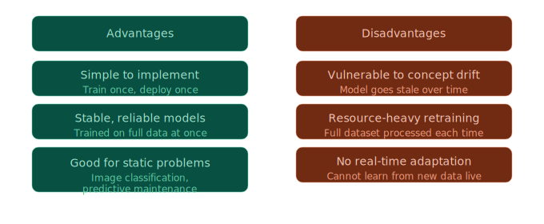
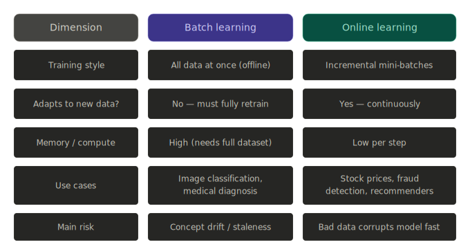
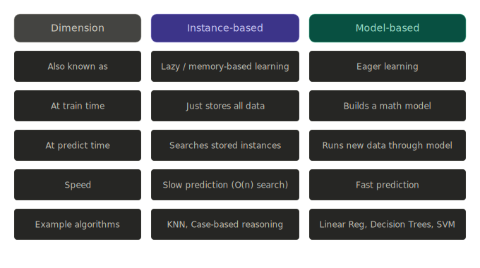

## Table of Contents

1. [Batch (Offline) Learning](#1-batch-offline-learning)
2. [Online (Incremental) Learning](#2-online-incremental-learning)
3. [Batch vs Online — Comparison](#3-batch-vs-online--comparison)
4. [Instance-Based Learning](#4-instance-based-learning)
5. [Model-Based Learning](#5-model-based-learning)
6. [Instance-Based vs Model-Based — Comparison](#6-instance-based-vs-model-based--comparison)
7. [Diagram assets](#diagram-assets)

---

## 1. Batch (Offline) Learning

### What is it?

Batch learning (also called **offline learning**) is a training approach where the model is trained on the **entire available dataset at once**. Once training is complete, the model is deployed and serves predictions — but it does **not** learn from new incoming data during operation.

### How it works

```
All Data → Train Offline (full dataset) → Trained Model → Deploy
                                                              ↓
                                                       New Data Arrives
                                                              ↓
                                              Retrain from Scratch (full dataset + new data)
                                                              ↓
                                                       Redeploy new model
```

### Figure — batch learning flow



### Figure — batch learning pros and cons



### Key Characteristics

- Training happens **offline**, not in real time
- The model is a **static snapshot** of what it learned
- To incorporate new data, you must **retrain everything from scratch** and redeploy
- Vulnerable to **concept drift** — when real-world patterns change, the model becomes stale

### Advantages

| Benefit | Why |
|---|---|
| Simple to implement | Train once, deploy once |
| Stable and reliable | Trained on the full dataset at once |
| High accuracy on static problems | No noise from incremental updates |

### Disadvantages

| Drawback | Why |
|---|---|
| Cannot adapt to new data live | Requires full retrain to incorporate changes |
| Resource-heavy retraining | Entire dataset processed every update cycle |
| Vulnerable to concept drift | Model becomes stale if data patterns shift |
| Not suitable for real-time data | No online adaptation capability |

### When to use Batch Learning

- Data is **stable and changes slowly** (e.g., historical records)
- You have sufficient compute to retrain periodically
- Examples: **image classification** (ImageNet), **predictive maintenance**, **medical diagnosis models**

### What is Concept Drift?

Concept drift occurs when the statistical properties of the target variable change over time. For example, customer spending patterns changed dramatically during COVID-19. A batch model trained before the pandemic would produce poor predictions during it — it has no way to self-update.

---

## 2. Online (Incremental) Learning

### What is it?

Online learning is a training paradigm where the model **learns continuously** from new data as it arrives — either one data point at a time or in small **mini-batches**. It does not need the entire dataset to be present before learning begins.

### How it works

```
Mini-batch 1 → Model Update → Mini-batch 2 → Model Update → Mini-batch 3 → ...
                     ↓
              Live Model (always up-to-date, always serving predictions)
```

### Figure — online learning flow



### Key Characteristics

- Training is **incremental** — no full retraining required
- The model is **always live** and always adapting
- Controlled by a **learning rate** — how fast the model adapts to new data
- Supports **out-of-core learning** — datasets too large to fit in RAM can be processed in chunks

### Learning Rate

The learning rate is a critical hyperparameter in online learning:

- **High learning rate** → model adapts quickly, but may forget old patterns (catastrophic interference)
- **Low learning rate** → model is more stable, but slower to react to genuine changes

### Out-of-Core Learning

When a dataset is too large to fit into memory, online learning can process it in mini-batches sequentially — reading from disk chunk by chunk. This makes it practical for **massive-scale datasets**.

Libraries that support this:
- **River** (`riverml.xyz`) — Python library for online ML
- **Vowpal Wabbit** — fast, scalable online learning system

### Advantages

| Benefit | Why |
|---|---|
| Adapts to new data continuously | No full retrain needed |
| Memory efficient | Only one mini-batch in memory at a time |
| Handles concept drift naturally | Model updates as patterns shift |
| Supports out-of-core learning | Works on datasets larger than RAM |

### Disadvantages

| Drawback | Why |
|---|---|
| Sensitive to bad data | Corrupt/noisy data immediately affects the model |
| Harder to implement | More complex pipeline than batch training |
| Risk of catastrophic interference | New data may overwrite old learned patterns |
| Requires careful learning rate tuning | Too fast or too slow causes instability |

### When to use Online Learning

- Data arrives as a **continuous stream** (e.g., stock prices, sensor feeds)
- The environment **changes rapidly** (e.g., fraud patterns, user preferences)
- The dataset is **too large** to fit in memory (out-of-core learning)
- Examples: **stock price prediction**, **fraud detection**, **recommendation engines**, **ad click prediction**

---

## 3. Batch vs Online — Comparison

### Figure — batch vs online



| Dimension | Batch Learning | Online Learning |
|---|---|---|
| Training style | All data at once (offline) | Incremental mini-batches |
| Adapts to new data? | No — must fully retrain | Yes — continuously |
| Memory / compute | High (needs full dataset) | Low per step |
| Prediction speed | Fast (model is static) | Fast (model is live) |
| Handles concept drift | Poorly — model goes stale | Well — updates automatically |
| Main risk | Model staleness | Bad data corrupts model fast |
| Use cases | Image classification, medical diagnosis | Stock prices, fraud detection, recommenders |
| Typical schedule | Retrain periodically (daily/weekly) | Always learning |

---

## 4. Instance-Based Learning

### What is it?

Instance-based learning (also called **lazy learning** or **memory-based learning**) is an approach where the model **does not build an explicit mathematical model** during training. Instead, it memorises all training examples and makes predictions by **comparing new data to stored instances** using a similarity measure.

### How it works

```
Training phase:
  Training Data → Store all instances in memory (no model built)

Prediction phase:
  New data point → Measure similarity to all stored instances
                 → Find k nearest neighbors
                 → Predict based on majority class / average
```

### Figure — instance-based learning



### Key Characteristics

- **No explicit training** — the algorithm is "lazy" at train time
- All computation is **deferred to prediction time**
- Prediction cost = O(n) — must compare against every stored instance
- Stores all data in memory — **memory-intensive** for large datasets
- Also known as **lazy learning** because no generalisation happens until a query arrives

### Primary Algorithm: K-Nearest Neighbors (KNN)

KNN is the canonical instance-based algorithm:

1. Given a new data point, compute its **distance** to all training points (e.g., Euclidean distance)
2. Select the **k closest** points (neighbors)
3. For **classification**: predict the majority class among the k neighbors
4. For **regression**: predict the average value among the k neighbors

The choice of **k** controls the smoothness of predictions:
- Small k → sensitive to noise (high variance)
- Large k → smoother, but may miss local patterns (high bias)

### Advantages

- Simple to understand and implement
- No training time — just store the data
- Naturally adapts to new data (just add it to memory)
- Works well for **both numeric and categorical** datasets
- No assumptions about the underlying data distribution

### Disadvantages

- **Slow predictions** — O(n) search through all stored instances
- **Memory-heavy** — must store the entire training set
- Sensitive to irrelevant features and feature scaling
- Not suitable for very large datasets
- No interpretability — no formula or rules to inspect

### Use Cases

- Recommender systems (find similar users/items)
- Anomaly detection
- Image recognition (on small datasets)
- Medical diagnosis (find similar past cases)

---

## 5. Model-Based Learning

### What is it?

Model-based learning (also called **eager learning**) is an approach where the algorithm **builds a mathematical model** from training data. The model captures generalised patterns and relationships, and is then used to make predictions — **without needing the original training data at prediction time**.

### How it works

```
Training phase:
  Training Data → Learn patterns → Build mathematical model (parameters learned)
                                         ↓
                              Original data no longer needed

Prediction phase:
  New data point → Pass through model function → Fast prediction
```

### Figure — model-based learning



### Key Characteristics

- **Generalises** from data — extracts patterns into parameters
- Prediction is **fast** — just run the input through a math function
- Original training data is **discarded** after training
- Requires an optimisation process during training (e.g., minimising loss)
- More interpretable than instance-based approaches (depending on model)

### Common Algorithms

| Algorithm | How it generalises |
|---|---|
| Linear Regression | Fits a straight line (y = mx + b) through data |
| Decision Trees | Builds a tree of feature-based decision rules |
| Neural Networks | Learns layered non-linear representations |
| Support Vector Machine (SVM) | Finds the optimal separating hyperplane |
| Random Forest | Ensemble of decision trees |

### Advantages

- **Fast predictions** — no data lookup required
- **Memory efficient** — only store model parameters, not raw data
- Can generalise well to unseen data
- Many models offer interpretability (e.g., decision trees, linear regression)
- Scales well to large datasets

### Disadvantages

- Requires careful **model selection** and **hyperparameter tuning**
- Can **underfit** (too simple) or **overfit** (too complex) the data
- Training can be computationally expensive (especially deep neural networks)
- Fixed — does not automatically update when new data arrives (without retraining)

### Use Cases

- Predicting house prices (Linear Regression)
- Email spam classification (Logistic Regression / SVM)
- Weather forecasting (Neural Networks)
- Disease diagnosis (Random Forest)
- Any large-scale production ML system

---

## 6. Instance-Based vs Model-Based — Comparison

### Figure — instance-based vs model-based



| Dimension | Instance-Based | Model-Based |
|---|---|---|
| Also known as | Lazy / memory-based learning | Eager learning |
| At train time | Just stores all data | Builds a mathematical model |
| At predict time | Searches stored instances | Runs input through model function |
| Training speed | Very fast (no learning) | Slower (optimisation required) |
| Prediction speed | Slow — O(n) search | Fast |
| Memory usage | High (stores all data) | Low (stores only parameters) |
| Generalisation | No explicit generalisation | Explicit generalisation |
| Interpretability | Low | Varies (high for trees, low for NNs) |
| Handles new data | Just add to memory | Needs retraining |
| Example algorithms | KNN, Case-Based Reasoning | Linear Regression, Decision Trees, SVM, Neural Networks |

---

## Summary

```
ML Training Types
│
├── By training schedule
│   ├── Batch (Offline) Learning    → Train on all data at once, static model
│   └── Online (Incremental)        → Learn from data stream, always updating
│
└── By generalisation approach
    ├── Instance-Based (Lazy)       → Memorise data, compare at query time
    └── Model-Based (Eager)         → Build a model, discard data, predict fast
```

These four concepts together define **how** a machine learning system learns and **when** it learns — foundational decisions that shape the architecture of any real-world ML system.

---

## Diagram assets

SVG diagrams live in the repo `assets/` folder. Reference:

| File | Topic |
| --- | --- |
| `batch_learning_flow.svg` | §1 Batch — end-to-end flow |
| `batch_learning_pros_cons.svg` | §1 Batch — pros and cons |
| `online_learning_flow.svg` | §2 Online — incremental updates |
| `batch_vs_online_comparison.svg` | §3 Batch vs online table |
| `instance_based_learning.svg` | §4 Instance-based flow |
| `model_based_learning.svg` | §5 Model-based flow |
| `instance_vs_model_comparison.svg` | §6 Instance vs model table |

---

*Notes based on CampusX 100 Days of Machine Learning — Videos 4, 5, 6*  
*Playlist: [PLKnIA16_Rmvbr7zKYQuBfsVkjoLcJgxHH](https://www.youtube.com/playlist?list=PLKnIA16_Rmvbr7zKYQuBfsVkjoLcJgxHH)*
